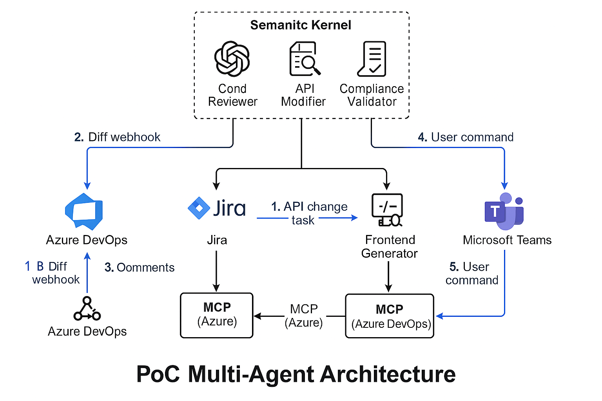

# Multi-Agente DevOps PoC (Azure OpenAI + Azure DevOps + Semantic Kernel)



[](https://azure.microsoft.com)
[](https://azure.microsoft.com/en-us/products/ai-services/openai-service/)
[](https://dev.azure.com)
[](https://opensource.org/licenses/MIT)

Esta PoC implementa una arquitectura multiagente basada en Model Context Protocol (MCP) utilizando tecnologías de Microsoft para mejorar tareas de desarrollo: revisión de código, modificación de APIs y validación de cumplimiento.

El objetivo es mostrar un sistema tangible y funcional que pueda usarse como prueba ante su jefe y equipo técnico.

## Casos de Uso Confirmados

### ✅ 1. Revisión de Pull Requests
Agente que analiza PRs automáticamente y revisa:
- Convenciones de estilo
- Duplicidad de código
- Posibilidades de refactor
- Cobertura de tests

### ✅ 2. Modificación de APIs
Agente que, a partir de una tarea en Jira (o Azure DevOps), propone cambios en endpoints:
- Añade campos nuevos
- Valida tipos y restricciones
- Actualiza documentación OpenAPI
- Genera tests asociados

### 🔄 3. Generación de Frontend (Opcional/Futuro)
Agente que genera código Angular a partir de diseños en Figma o imágenes.
(Este punto se abordará si los dos anteriores funcionan correctamente.)

## Estructura del Proyecto

```
multiagent-devops-poc/
├── agents/
│   ├── code_reviewer/
│   │   ├── function_code.py          # Revisión de código en PRs
│   │   └── prompt_template.txt       # Prompt base para análisis
│   ├── api_modifier/
│   │   ├── function_code.py          # Sugerencias de modificación API
│   │   └── prompt_template.txt       # Prompt base para entender specs
│   └── compliance_validator/
│       ├── function_code.py          # Validación contra reglas MCP
│       └── mcp_rules.json            # Reglas codificadas
├── orchestration/
│   └── semantic_kernel_setup.py      # Coordinación y contexto entre agentes
├── azure_functions/
│   ├── host.json
│   └── local.settings.example.json
├── devops_integration/
│   ├── pr_trigger_handler.py         # Hook de Azure DevOps
│   └── devops_api_utils.py           # Utilidades para conexión
├── teams_interface/
│   ├── bot_logic.py                  # Lógica del bot en Teams
│   └── prompt_handler.py             # Respuesta inteligente
├── requirements.txt
├── README.md
└── architecture_diagram.png          # Diagrama general del sistema
```

## Agente: Revisor de Pull Requests (`code_reviewer`)
Este agente actúa automáticamente sobre los pull requests en Azure DevOps y realiza un análisis de calidad de código. Se ejecuta como Azure Function y utiliza Azure OpenAI para generar sugerencias.

### 📄 `agents/code_reviewer/function_code.py`
```python
import os
import openai
import json

def main(req):
    code_diff = req.get_json().get("diff")

    prompt = open("agents/code_reviewer/prompt_template.txt").read().replace("{{DIFF}}", code_diff)

    openai.api_key = os.getenv("AZURE_OPENAI_KEY")

    response = openai.ChatCompletion.create(
        engine="gpt-4",
        messages=[
            {"role": "system", "content": "Eres un revisor de código experto en buenas prácticas de desarrollo y DevOps."},
            {"role": "user", "content": prompt}
        ]
    )

    return {
        "status": 200,
        "body": response["choices"][0]["message"]["content"]
    }
```

### 📄 `agents/code_reviewer/prompt_template.txt`
```
Analiza el siguiente diff de código:

{{DIFF}}

Indica:
1. Posibles mejoras de estilo o convenciones
2. Código duplicado o innecesario
3. Oportunidades de refactor
4. Cobertura de tests si aplica
```

Este agente se conecta a Azure DevOps mediante webhooks configurados en `devops_integration/pr_trigger_handler.py` para recibir el `diff` del PR.

## Orquestación
Usamos Semantic Kernel para compartir contexto entre agentes. MCPs de Azure y Azure DevOps permiten mantener estado, seguimiento de tareas y conexión con la intención de negocio. Cada agente es una Azure Function, con contexto persistente coordinado por SK.

## Integraciones
- **Azure Functions**: ejecución serverless de cada agente
- **Azure DevOps**: repositorio, PRs y posiblemente Boards si se usan
- **Jira**: disparador para modificar APIs basado en tareas
- **Microsoft Teams**: canal conversacional para invocar agentes

## Instrucciones
1. Clona el repositorio.
2. Crea recursos en Azure (Functions, OpenAI, DevOps tokens).
3. Configura `local.settings.json` con tus secretos.
4. Despliega las Functions y configura webhooks o triggers desde DevOps o Jira.

## Requisitos
```bash
pip install -r requirements.txt
```

## Próximos pasos
- ✅ Implementar los agentes con conexión real a Azure OpenAI.
- ✅ Crear un esquema visual (diagrama) de la arquitectura.
- 🔜 Añadir logging y trazabilidad entre agentes.
- 🔜 Preparar demo (video o presentación) para mostrar al equipo de OGA.

---

Este repositorio demuestra cómo se pueden usar agentes colaborativos con contexto compartido para aumentar la productividad en entornos reales de desarrollo.